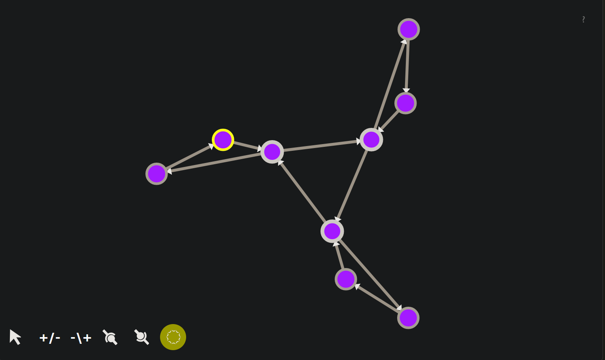

# Node-Force

A physics simulation sandbox of particles that connect to form larger structures which experience attractive and repulsive forces.

[Play Now](https://bradharms.github.com/example-node-force)

## Page Contents

1. [Node-Force](#node-force)
   1. [Page Contents](#page-contents)
   2. [How to Play](#how-to-play)
   3. [The Physics](#the-physics)
   4. [Idle Forces](#idle-forces)
   5. ["Signal" and "Signal Forces"](#signal-and-signal-forces)
   6. [Implementation Details](#implementation-details)
   7. [License](#license)

## How to Play

When the page is initially opened there are no particles present. The tools in the bottom left corner of the page can be used to create, destroy, connect, and disconnect nodes, and to add energy to the system in the form of "[signal](#signal-and-signal-forces):"

- **Mouse Pointer**: When selected, clicking a node will set it as the selected node, which is indicated by highlighting the node with a yellow outline.
- **+/-**: When selected, clicking an empty space will create a new node at that location, connect the selected node to it with an outbound connection, and then set the new node as the selected node. Can be used to quickly create chains of nodes.
- **-/+**: When selected, clicking an empty space will create a new node at that location, connect the selected node to it with an outbound connection, but does NOT set the new node as the selected node. Can be used to quickly create networks which are all connected to a central hub node.
- **Joint-and-Ball**: When selected, clicking a node will connect it to the currently selected node with an outbound connection from the selected node to the clicked node. If a connection already exists in that direction, the connection will instead be destroyed.
- **Ball-and-Joint**: When selected, clicking a node will connect the selected node to the clicked node with an outbound connection from the clicked node to the selected node. If a connection already exists in that the direction, the connection is instead destroyed.
- **Starburst**: When selected, clicking a node will impart "[signal](#signal-and-signal-forces)" into the clicked node.

## The Physics

Particles in the system are referred to as "nodes", which appear as purple circles with white edges. Nodes can form connections with any number of other nodes, and the connections will appear as white lines between connected nodes. When nodes connect, the structures they form are called "graphs".

connections are directional. One node in each connection is the "outbound" node and the other is the "inbound" node, where the "inbound" node has an arrowhead pointing to it. However, an "outbound" node may also have a second, separate connection back to the "inbound" node, making each node both an inbound and an outbound. This effectively creates a bidirectional connection. These connections appear as a double-headed arrow between two nodes.

## Idle Forces

The following rules govern the movement of nodes and graphs:

- There is not a concept of inertia or momentum. Movement does not impart any energy or force onto nodes. Nodes in motion do NOT stay in motion. Nodes only move in scale to forces they are experiencing presently.
- All nodes experience a slight attractive force towards the center of space which increases slowly with distance from the center. Therefore nodes further from the center will move towards the center faster, and will slow down as they approach the center.
- All nodes experience a strong repulsive force against each other which scales down quickly with distance.
- Nodes may not move beyond the edge of the screen. If a node contacts the edge of the screen, it will butt up against it.

The combine effect of the above rules is that, when left alone, nodes will tend towards a state of equilibrium where all nodes are spaced evenly in a hexagonal grid at the center of space. This is an emergent behavior and not directly specified by any unique rule.

## "Signal" and "Signal Forces"

Normally, connections have no effect on the behavior of nodes. However, each node can contain a non-negative, real number amount of energy called "signal".

Signal energy has the following effect on nodes:

- Signal increases the strength of node-to-node repulsion between that node and other nodes spatially close to it.
- Each outbound-connected node with signal experiences an attractive force in the direction of each of the inbound nodes to which the outbound node is connected. However, this force is NOT experienced by the inbound node, unless the inbound node is bidirectionally connected back to the outbound node.
- An outbound-connected node with signal will transfer a small amount of its own signal to each of its inbound-connected nodes per unit of time.
- Signal constantly decreases for all nodes at a linear rate even for nodes that are not giving their signal to other nodes. This quantity of signal disappears entirely from the system.

The following behaviors emerge from the above rules:

- A node with signal will tend to "chase" other nodes to which it is connected via one-way outbound connections.
- Graphs with two-way connections containing equally-distributed signal will tend to form rigid, geometrically symmetric structures.
- Graph sub-components where all nodes are connected cyclicly and where all connections are of the same kind (either unidirectional or bidirectional) will collectively hold their signal for much longer than disconnected nodes and exit-only nodes.
- Graph sub-components where nodes are all connected cyclicly and unidirectionally will try to form round paths that rotate about their centerpoint whenever "signal" is present in the system.

## Implementation Details

This is a vanilla JavaScript project. It uses SVG to render elements to the screen and respond to user input. It is entirely contained within the file `index.html` and has no external dependencies. Loading the file in any modern desktop browser should be enough to run it.

## License

This project is released under the terms of the [MIT license](LICENSE.md).
